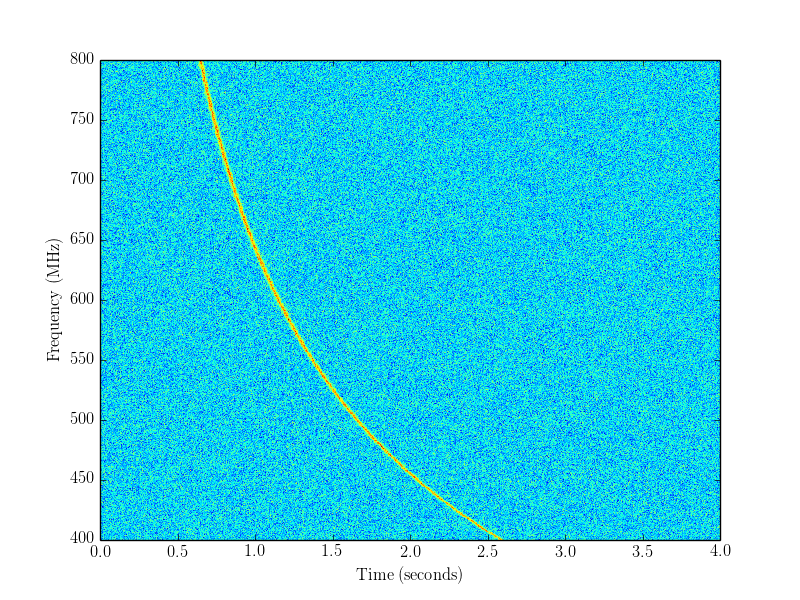

Example 1: simulating an FRB
============================

*Note that the documentation is for the cmake_pybind11 branch of simpulse, not the master branch!*
The cmake_pybind11 simpulse branch will be merged to master soon.

Note: before running the example scripts, you will need to do ``make install`` in the build directory (``make`` is not enough).

The following plot shows Gaussian noise, plus a simulated FRB with signal-to-noise ratio 250, in the (frequency, time) plane:

Here is the script to create it (simpulse/examples/python/01-simulating-frb.py).

.. literalinclude:: ../../simpulse/examples/python/01-simulating-frb.py
    :language: python
