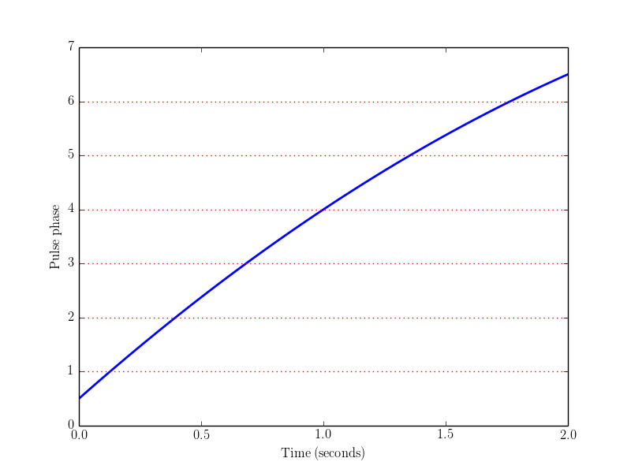
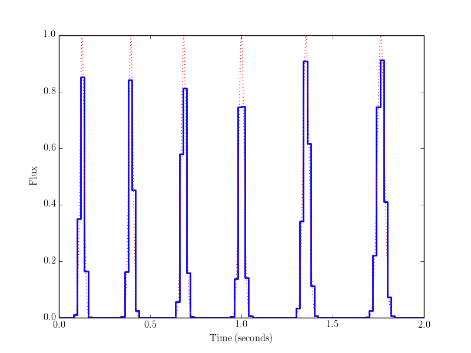

Example 2: simulating a pulsar
==============================

The solid blue curve below shows the "phase model" of a pulsar.  By definition, this is a function Phi(t)
which takes integer values when the observed pulse flux is maximized.  Therefore, pulses occur when the red 
dotted lines (which correspond to integer y-values) intersect the blue curve.

In the next plot, the solid blue curve is a simulated timestream for the pulsar whose phase model was
shown in the previous plot.  The pulses appear slightly different from each other, and have an irregular 
"stair-step" appearance.  This is because the time sample size used in the simulation (20 ms) is comparable
to the width of the pulses (~30 ms).

The red dotted curve shows the same simulation, sampled at high resolution.  By default, simpulse obtains
the low-resolution time samples (blue curve) by averaging the high-resolution profile (red dotted curve)
over each time sample.  This precsription is more accurate than say, evaluating the instantaneous flux at 
the midpoint of each sample.

Here is the script to create these plots (simpulse/examples/python/02-simulating-pulsar.py):

.. literalinclude:: ../../simpulse/examples/python/02-simulating-pulsar.py
    :language: python
